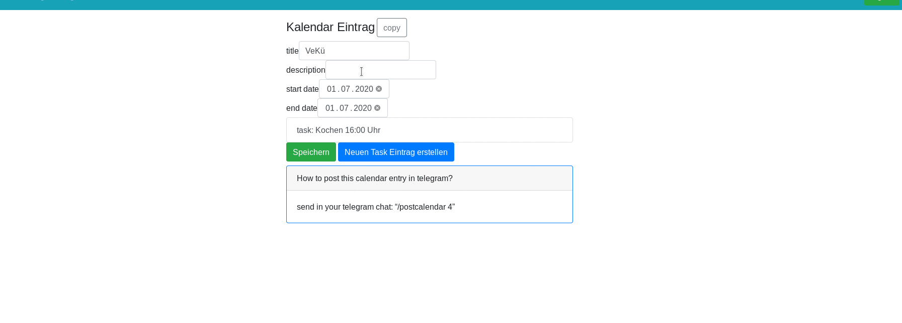
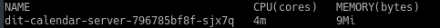

# dit-calendar

This is a tool for (collective) participatory/collaborative projects. A calendar with tasks for self-administration of work for groups. The main goal for this tool is to provide an calendar for events, create tasks for an event and allow a user-task assigment via [telegram](https://telegram.org/).

you can create an event with tasks

and post it in your telegram group/channel, so a person can assign hirself

## how to use
To be able to use this application in your telegram group, you must first complete following steps:
1. create an account on [dit-calendar-UI](https://dit-calendar.github.io/)
2. create a telegram Bot
   * start a conversation with [@Botfather](https://t.me/botfather)
     * write `/newbot`
     * give your Bot a name, maybe a nice picture and **please mention this website in your Bot description**
3. start the program for your telegram Bot by clicking on
     (you need an account but its free)
   * it will build the the current code and start the program - but it will not be update automatically!
   * if the server code has changed, your Bot may not be functioning properly anymore
   * **you are responsible for updating it!**
   * you can delete the program at any time on heroku and simply click on the heroku-buttton again to get the [latest version](https://github.com/dit-calendar/dit-calendar-bot/releases)

Careful! **This application is still in beta** and will be further developed after some [feedback](https://github.com/dit-calendar/dit-calendar.github.io/issues) from you. We will try to avoid code changes which will break an old version of the Bot. But we will only take into account the last release. If your Bot is already two versions behind, we do not promise compatibility.

## resource usage

:deciduous_tree: All programs have been developed with resource-saving in mind.
* the application will sleep after some time if nobody is using it, and will wake up as soon as someone interacts with the UI or the Bot.
* The server currently requires 4 milliCPU and 9 Mb RAM

* the [dit-calendar-UI](https://dit-calendar.github.io/) size is about 50 Kb
* but the Bot still need improvement

## source code

### dit-calendar-server 
The backend is build on happstack in haskell.
https://github.com/dit-calendar/dit-calendar-server

### dit-calendar-ui 
Very simple web-ui written in elm. For creating events and tasks from the perspective of the organization group.
https://github.com/dit-calendar/dit-calendar-ui

### dit-calendar-bot 
Telegram bot for user task assignment written in kotlin.
https://github.com/dit-calendar/dit-calendar-bot
