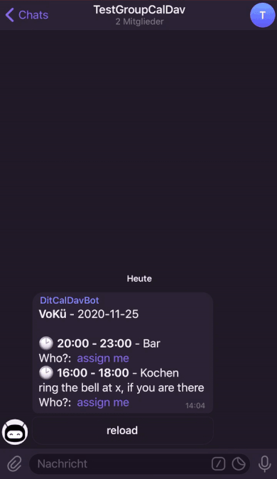

This is a tool for user-event assignment via [telegram](https://telegram.org/). It's designed to help (public/collective/participatory/collaborative) groups to organize work.

after you created an event or a task in your calendar 

post it in your telegram group/channel, so a person can assign hirself

This software is open source. You are in control, because each group has its own Bot. And it can be used free of charge via [heroku](https://www.heroku.com/).

Depending on the calendar you want to use, following telegram bots are available:
* you already using an online calendar, like the google calendar, nextcloud, owncloud [etc.](https://en.wikipedia.org/wiki/CalDAV#Server)? Then try the [CalDAV-telegram-bot](https://github.com/dit-calendar/caldav-telegram-bot)
* if you don't have a calendar yet and you prefer a simple 1-click solution, check out the teamup calendar and the [teamup-telegram-bot](https://github.com/dit-calendar/teamup-telegram-bot)
* you don't want a full calendar, and a simple UI for creating tasks is enough for you? Try the [dit-calendar-bot](https://github.com/dit-calendar/dit-calendar-bot)
